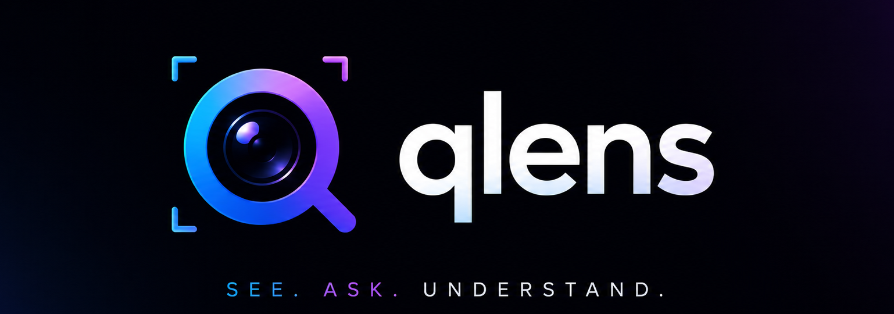
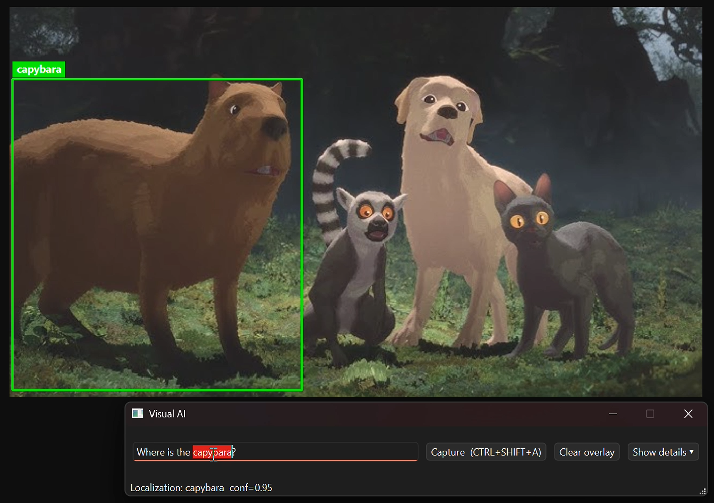
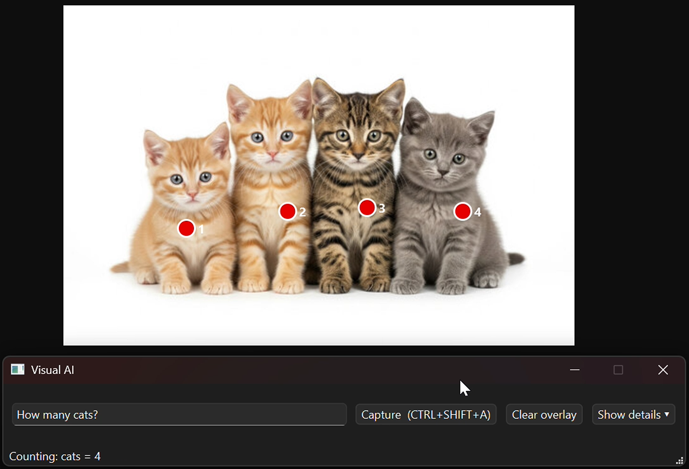

# qlens



> Local desktop app for visual grounding, multi-object detection, counting, and video frame-by-frame analysis on any region of your screen.

Powered by **Qwen2.5-VL:7B** running locally through **Ollama**. 100% offline, no cloud calls, no telemetry.

Select an area of your screen like in Snipping Tool, type a question, and the app draws the answer directly on top of your screen.

- "show me where the cat is" -> green bounding box on the cat
- "show cat and dog" -> two colored bounding boxes (multi-object mode)
- "how many people?" -> red numbered dots on every person + total count
- "when does a red car appear?" -> per-frame video analysis with timestamps

Author: **Tomasz Wietrzykowski**

License: MIT

---

## Screenshots

**Object localization** - query: "Where is the capybara?" - the model places a green bounding box around the capybara in the scene with confidence 0.95.



**Object counting** - query: "How many cats?" - the model detects all four kittens, marks each with a numbered red dot, and returns the total count of 4.



---

## Features

- **Single-object localization** with bounding box and confidence score.
- **Multi-object localization** with colored bounding boxes (toggle via Settings: Max objects > 1).
- **Counting** (multi-instance detection) with numbered centroid points and total count.
- **Video analysis pipeline**: continuous frame capture from a screen region (for example a YouTube player), per-frame description by Qwen2.5-VL, then text-only aggregation that answers the original question.
- **Click-through screen overlay** that draws results directly on the desktop, plus an optional detail view with the cropped image, drawn annotations, and raw JSON.
- **Deterministic coordinate lock**: a single `CoordinateMapper` maps model space (0-1000) through letterbox inference space, crop pixels, and back to physical screen pixels (DPI-aware on Windows 11).
- **Global hotkey** Ctrl+Shift+A plus an in-app Capture button.
- 100% local, no cloud calls, no telemetry.

---

## Pipeline

```
[Screen Capture]
      v
[Region Selector (Snipping-Tool-like)]
      v
[Crop + offset metadata (Region)]
      v
[Letterbox resize to fixed inference size]
      v
[Qwen2.5-VL inference via Ollama (/api/chat, format=json)]
      v
[Strict JSON parser + schema validation]
      v
[CoordinateMapper: model 0-1000 -> infer px -> crop px -> screen px]
      v
[Overlay renderer (bbox / points) + result view]
```

For video mode, the loop is:

```
grab frame -> resize -> Qwen2.5-VL one-sentence description -> store (ts, text)
   ...repeat until Stop or Max frames...
   -> qwen2.5 text aggregator -> final answer (with timestamps if asked)
```

---

## Requirements

- Windows 11 (the app is built and tested on Win11; the Region selector and DPI handling are Win-specific).
- Python 3.11+
- [Ollama](https://ollama.com) running locally on `http://localhost:11434`
- Models pulled in Ollama:
  - `qwen2.5vl:7b` (vision-language, used for grounding / counting / per-frame description)
  - `qwen2.5:7b` (text-only, used to aggregate the per-frame video timeline into a final answer)

Pull the models:

```powershell
ollama pull qwen2.5vl:7b
ollama pull qwen2.5:7b
```

---

## Installation

```powershell
git clone https://github.com/tomaszwi66/qlens.git
cd qlens
python -m venv .venv
.\.venv\Scripts\Activate.ps1
pip install -r requirements.txt
```

> **Note:** the global hotkey is registered via the `keyboard` package, which on Windows usually requires the terminal to be run as Administrator. The in-app Capture button and the in-window shortcut Ctrl+Shift+A work without admin.

---

## Running

```powershell
python main.py
```

The window opens as a compact bar. Type a question, then either:

- press **Capture image** (or **Ctrl+Shift+A**, or just hit Enter) to drag-select a screen region for a single image task, or
- press the orange **Video Mode** button to drag-select a video region and start continuous frame-by-frame analysis.

Press **Details** to expand the lower panel with the annotated crop preview and raw JSON / debug output. While Video Mode is active a red banner appears across the top of the window with the live status.

---

## Usage

### 1. Single object localization

1. Type a question like `show me where the cat is`, `where is the TV?`, or `find the mug`.
2. Press **Capture image**.
3. Drag-select the region of the screen to analyze.
4. A green bounding box is drawn on top of the screen with the object label and confidence.

### 2. Multi-object localization

1. Click the gear icon to open **Settings**.
2. Set **Max objects per detection** to a value greater than 1 (for example 5).
3. Click OK.
4. Type a question that names multiple objects, for example `show cat and dog`, or a general query like `find all cars`.
5. Press **Capture image** and select a region.
6. Each detected object is drawn with a different color (green, orange, cyan, pink, ...).

### 3. Counting

1. Set Max objects back to 1 (counting mode is triggered by the wording of the query, not by this setting).
2. Type a question like `how many people?`, `count all cars`, `total number of cups`.
3. Press **Capture image** and select a region.
4. Each detected instance is drawn as a numbered red dot. The total count is shown in the status bar and at the top of the annotated crop preview.

### 4. Video analysis

1. Type a question about the video: `summarize this video`, `when does a red car appear?`, `when does something dangerous happen?`, `what is going on in this scene?`.
2. Press the orange **Video Mode** button and drag-select the region that contains the video playback (for example a YouTube player on the page).
3. The app starts capturing frames continuously: each new frame is grabbed as soon as the previous one has been processed by the model. A red banner across the top of the window shows the live status (which frame is being grabbed, which one is being analyzed, the running frame count). Expand **Details** if you want to see the full per-frame timeline and the latest frame preview.
4. Press the red **STOP VIDEO** button (same button, it morphs while recording) when you have enough frames. The text-only aggregator then receives the original question together with the full timeline and produces a final answer.
5. The final answer pops up in a separate dialog window with the answer on top and the full per-frame timeline below.

Automatic stop also occurs when **Max frames** is reached.

---

## Settings

Open with the gear icon in the top bar.

| Setting | Default | Range | Description |
|---|---|---|---|
| Max objects per detection | 1 | 1 - 20 | If 1, single-bbox mode (`localization`). If > 1, multi-bbox mode (`multi_localization`). Counting is always triggered by query wording, not by this setting. |
| Video frame interval | 0.0 s | 0 - 30 s | Delay between frame captures. The default 0 means continuous: the next frame is grabbed as soon as the previous one has been processed. Set a positive value to space frames out in time. |
| Video max frames | 60 | 1 - 1000 | Hard cap on captured frames; the loop also stops on demand. |

Model names and the Ollama URL live in `config.py`:

```python
OLLAMA_URL = "http://localhost:11434/api/chat"
MODEL_NAME = "qwen2.5vl:7b"        # vision-language model
TEXT_MODEL_NAME = "qwen2.5:7b"     # text-only aggregator for video
INFER_SIZE = 1024                  # letterbox size sent to the model
HOTKEY = "ctrl+shift+a"
```

---

## How the coordinate lock works

Qwen2.5-VL is instructed (via the system prompt) to return all coordinates normalized to the integer range `[0, 1000]` relative to the image it sees. The app converts those back to absolute screen pixels through a fixed, fully deterministic chain:

```
model_0_1000  --(/1000 * INFER_SIZE)-->  infer_px
infer_px      --((p - pad) / scale)  -->  crop_px
crop_px       --(+ region.x, + region.y) -->  screen_px (physical)
```

Letterbox parameters (`scale`, `pad_x`, `pad_y`) are stored inside `CoordinateMapper` and used in reverse when projecting model coordinates back to the screen. No module computes coordinates on its own; everything goes through this single mapper. This guarantees that overlays land exactly on the captured object regardless of the region size, aspect ratio, or DPI scaling factor.

DPI scaling on Windows is handled by:

1. Calling `SetProcessDpiAwareness(2)` (per-monitor v2) before creating the `QApplication`.
2. Multiplying selection rectangles by the screen `devicePixelRatio()` so that `mss` grabs the correct physical pixels.
3. Dividing back by `devicePixelRatio()` inside the overlay so PyQt6 paints at the right logical pixel.

---

## Project layout

```
qlens/
  main.py                    # entry point, DPI awareness, hotkey, QApplication
  config.py                  # Ollama URL, model names, defaults
  requirements.txt
  README.md
  LICENSE
  core/
    capture.py               # Region dataclass + mss-based screen grab
    region_selector.py       # Frameless fullscreen Snipping-Tool-like selector
    coords.py                # CoordinateMapper + letterbox prepare_image
    intent.py                # Keyword-based task routing (count vs locate)
    prompt.py                # System / user / video aggregation prompts
    ollama_client.py         # chat(), chat_with_retry(), chat_text()
    parser.py                # JSON schema validation + clamping
    video.py                 # VideoAnalyzer worker (frame loop + aggregation)
  render/
    draw.py                  # OpenCV bbox / multi-bbox / points renderers
  ui/
    main_window.py           # Compact bar, recording banner, details panel, threading glue, video answer dialog
    overlay.py               # Click-through fullscreen overlay (PyQt6)
    result_view.py           # Scaled QLabel preview of the annotated crop
    settings_dialog.py       # Max objects, video interval, video max frames
```

---

## JSON contracts returned by the model

```jsonc
// task = localization (single bbox)
{
  "task": "localization",
  "object": "cat",
  "bbox": [x1, y1, x2, y2],     // all integers in [0, 1000]
  "confidence": 0.0
}

// task = multi_localization
{
  "task": "multi_localization",
  "objects": [
    {"name": "cat", "bbox": [x1, y1, x2, y2], "confidence": 0.0},
    {"name": "dog", "bbox": [x1, y1, x2, y2], "confidence": 0.0}
  ]
}

// task = counting
{
  "task": "counting",
  "object": "person",
  "count": 5,
  "instances": [
    {"id": 1, "point": [x, y]},
    {"id": 2, "point": [x, y]}
  ]
}
```

The Ollama call uses `format: "json"` and a low temperature (0.1), with one retry at temperature 0.0 if the first response fails to parse. The parser clamps every coordinate into `[0, 1000]` and normalizes bbox ordering.

---

## Troubleshooting

- **The bounding box is offset or smaller than expected** - this is almost always Windows DPI scaling. The app already handles per-monitor v2 awareness; if you still see drift, check Settings -> System -> Display -> Scale and try 100% to verify.
- **`requests.exceptions.ConnectionError`** - Ollama is not running. Start it from the Ollama tray icon or run `ollama serve`.
- **`model not found`** - run `ollama pull qwen2.5vl:7b` and `ollama pull qwen2.5:7b`.
- **The global hotkey Ctrl+Shift+A does nothing** - either run the terminal as Administrator, or use the in-window shortcut / Capture button.
- **Inference is slow** - Qwen2.5-VL 7B on consumer hardware typically takes 5 - 15 seconds per frame. For video analysis, set the frame interval to 0 so the loop runs back-to-back and lower Max frames.
- **Result drawn at the wrong location on a second monitor** - make sure the Windows display scale is identical across monitors, otherwise per-monitor DPR differences can offset the overlay. Open an issue with your screen layout if this happens.

---

## Roadmap ideas

- Persisted settings (currently kept in memory for the session).
- Drag-and-drop image input (analyze a file without going through screen capture).
- Configurable model name from the Settings dialog.
- Optional GPU acceleration for the letterbox resize.

---

## Acknowledgements

- [Ollama](https://ollama.com) for the local model serving runtime.
- [Qwen2.5-VL](https://huggingface.co/Qwen) by Alibaba for the vision-language model.
- PyQt6, OpenCV, mss, and the broader Python ecosystem.
